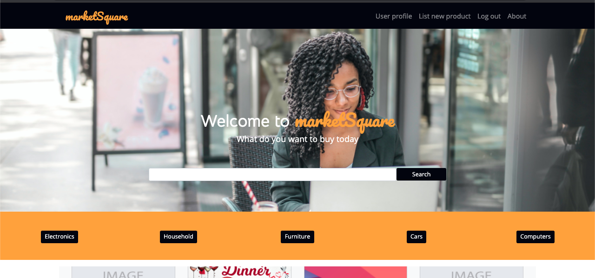
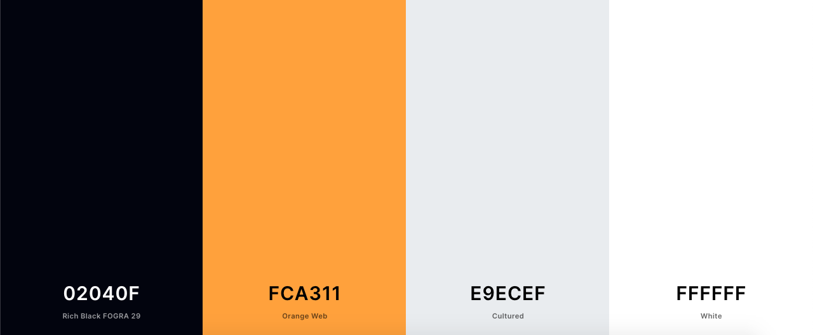
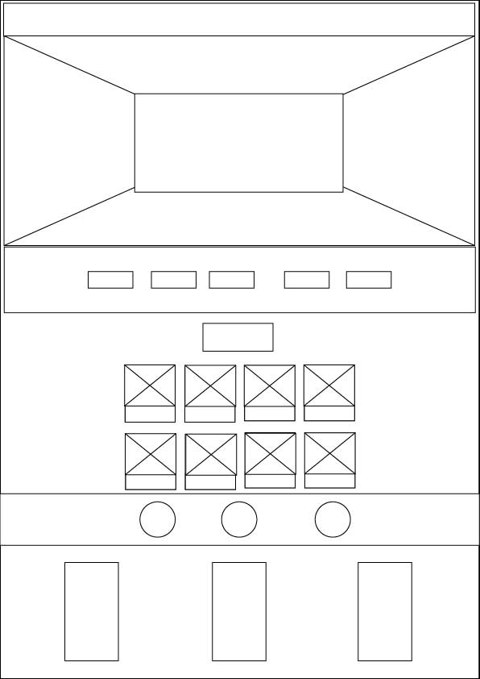
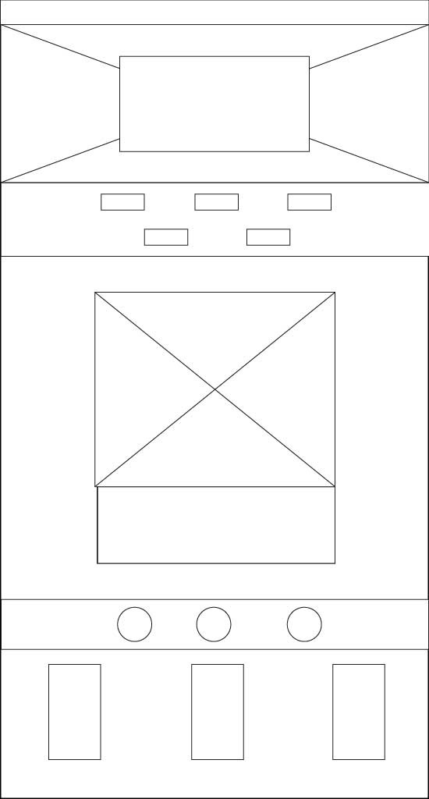
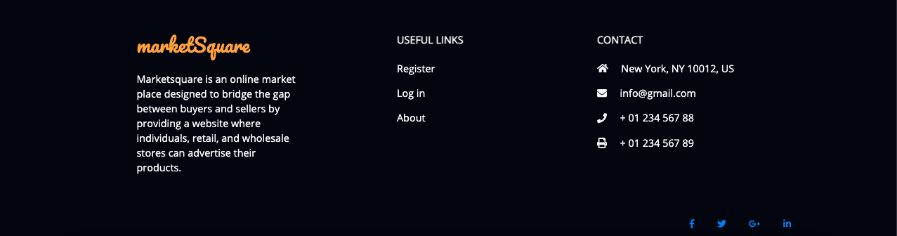
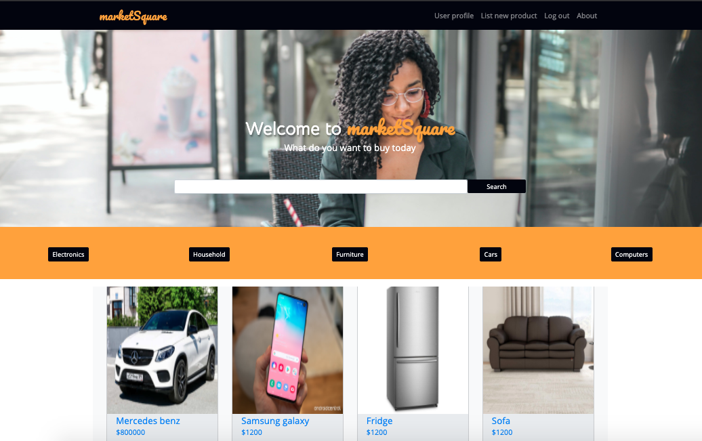
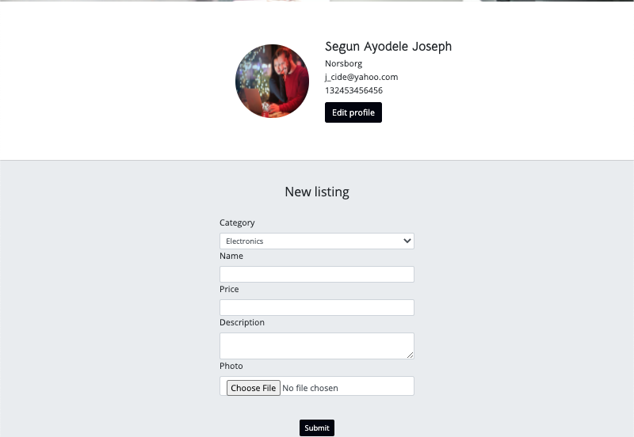
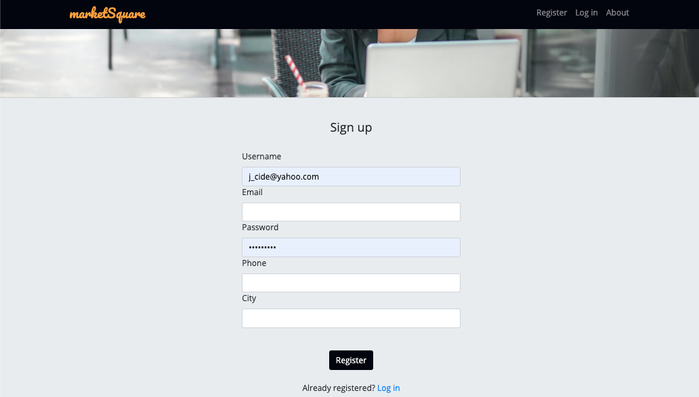
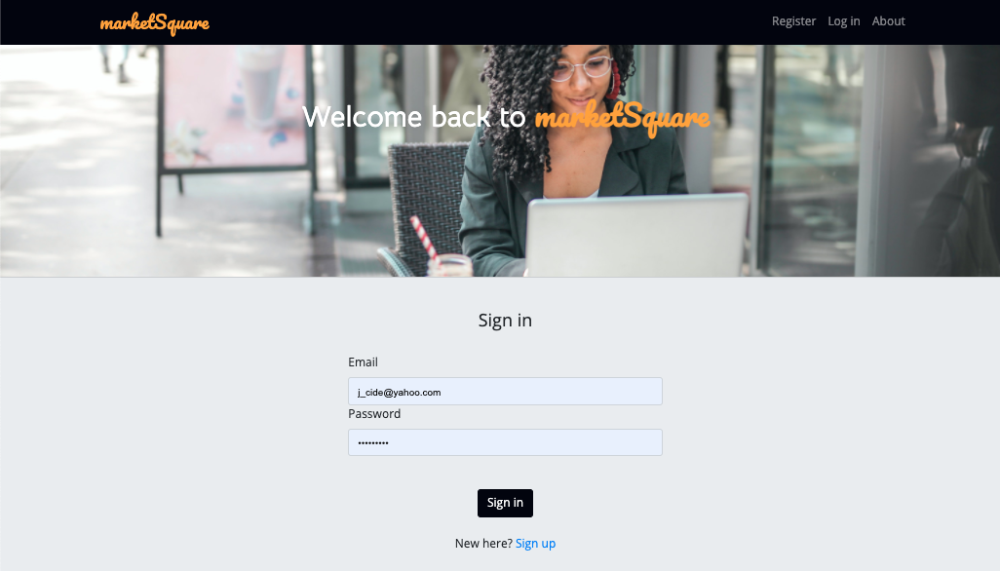

## Table of Contents

## 1.UX
### Visitir's Goal
### Business Goal
### Design Choice
### Wireframe

## 2.Features
### Homepage
### Register page
### Login page
### Profile page
### Profile update page
### Search engine
### Category section
### Selected Item page 

### 3.Information Architecture
### 4.Technologies Used
### 5.Testing
### 6.Deployment
### 7.Credits

Marketsquare is an online market place designed to bridge the gap between buyers and 
sellers by providing a website where individuals, retail, and wholesale stores can 
advertise their products. Marketsquare provides the convenience of searching products
or items by visitors of the website looking to make a purchase, connecting them directly 
to the seller. Marketsquare was designed by Segun Ayodele as the third milestone project
on the Diploma in Software Development at Code Institute.

## UX
### Users Goal
* Helps sellers and buyers transact remotely.
* Gives buyers access to variety of products and multiple vendors to compare
* Eliminates the barrier of closing time as Marketsquare runs continously without closing.
* Provides sellers with the ability to list as many product as they want and also manage 
    and update their listings.

### Business Goal
* To create a platform that connects buyers and sellers together.
* To grow a database of vendors and on a global scale for marketing and reseach purposes.
* To provide ease of transaction for buyers and vendors without the limitation of time and distance.

### User Story
#### Persona
Anna is a software developer that just secured a job outside the country, she has 
some household items and furnitures she wants to sell before relocating.
Justin is a craftsman that specializes in woodwork and he is looking for means of selling his 
works without renting an outlet to showcase his craft.
They both:
* Register on Marketsquare and created a profile.
* Listed the items they want to sell with detailed Information.
* Manage information of listed items and delete items that are out of stock.

Tina's friend needs a laptop for studies, her friend cannot afford it at the moment 
so Tina has decided to buy a used laptop for her friend,so;
* Tina visits Marketsquare and searched for a laptop in the search engine.
* Tina gets a search result of laptops listed on Marketsquare.
* Tina clicks on the ones with competitive prices to read more about them.
* Tina decides to go with the last viewed laptop and gets the contact of the vendor.
* Tina negotiates with the vendor and carry out the transaction.

### Design Choice

**Fonts**
* Open Sans
* Bellota
* Pacifico

**Colour**

**WireFrame**
* Mobile view

* Desktop view

## Features
### Existing Features
* __Navbar__ features on every page of the website and contains the brand name links to homepage, menu-links to register 
    and login pages and also navigation around the website.

* __Footer__ features on all the pages and also contains navigation links around the website, social media icons, 
    category buttons and links to register and login pages.

* __Home page__ contains the landing image where the welcome message and also the search engine for visitors 
    to search for items they want to buy.
    Next on the home page is the category section which features the buttons of existing categories that buyers 
    can use to filter the items displaying to a specific category.
    Also featured on the home page is the listed items section where products and items listed for scale
    is displayed before a search is carried out.

    Next to the listed items section is How it works section explaining in three steps how the website works
* __User profile page__ contains the information and profile picture of a registered vendor with an update 
    button that allows the vendor to update personal information, also on the page is the items listed by 
    the vendor which also gives the vendor the ability to update or delete a listed item. a vendor will only 
    access this page on registering or login.

* __Item Listing page__ can only be accessed by logged in users and this is where new items or products are 
    uploaded into the database and every item is connected to the vendor through a unique id.

* __Register page__ is where a new user creates an acount with some information required of the user,such as 
    username, email, password, phone, and city which are recieved through a simple input form.

* __Login page__ provides a standard login form for registered user to access their personal profile and 
    listings. The login form requests an email and password for a user to sign in.

* __Log out__ allows a signed in user to log out of their page therefore clearing their user session and 
    redirecting to the login page.

## Technology Used

### Tools
* __Adobe Illustrator__ used for wireframe design.
* __Adobe Photoshop__ used for image resize and compression.
* __Git__ for version control
* __Heroku__ for hosting of the website.
* __Coolors.co__ for color palette generation.

### Libraries
* [Bootstrap](https://getbootstrap.com/) To simplify the responsiveness and the structure of the website.
* [Google Fonts](https://fonts.google.com/) for font styling.
* [jQuery](https://jquery.com/) To simplify DOM manipulation.
* [Font Awasome](https://fontawesome.com/) To incorporate icons.
* [Jinja Framework](https://jinja.palletsprojects.com/en/2.11.x/) Used for template execution and code re-usability.

### Programming Languages
* HTML
* CSS 
* Javascript
* Python
* Ginger Template

### Database
* MongoDB

## Test
The following tools were used to validate and beautify the codes:
* [Freeformatter](https://www.freeformatter.com/html-formatter.html#ad-output) used to beautify the HTML code.
* [BeautyTools](http://beautifytools.com/css-validator.php) used to beautify and validate the Javascript and CSS codes.

The navigation of this website has been tested, and every button works with the exception of the social media icon and the About Us page.
The website responsiveness has also been tested at all screen sizes and it adapts and displays properly.
The test carried out on the functionality of the diagnosis web application includes:
* XMLHttpRequest and Response for symptom JSON.
* User Input Iteration through the symptom JSON.
* User symptom input autocomplete through iteration of symptom JSON
* Symptom ID appended into an array from Iteration result.
* Token auto generator request.
* User is alerted on symptom typo error.
* XMLHttpRequest and Response for diagnosis JSON.
* Diagnosis result returned and displayed on submission.

The above listed functionalities were tested and works as expected.

To test the diagnosis web app, use the following combinations of symptoms:

### Limitations
* Marketsquare does not have location feature therefore can not connect buyer and seller nearby.
* Marketsquare requires authentication for only buyers therefore there is no chat functionality.
* There is no shopping cart functionality currently on Marketsquare website.

results, the year of birth and sex remains until page reloads or manually removed.
* when symptom combinations returns no diagnosis result, there is no message to 
alert the user.
* Because of time constraint, the schedule generator API could not be integrated 
into the website, instead the schedule button links an external schedule generator service.
* The About us page was not designed

## Deployment
Hope Diagnostics is deployed and hosted on github pages. 
From the repository, I clicked setting then selected a theme under the section of github 
pages. I then wrote about Curryt website then commit the changes. Finally, I added my repository 
name for it to be searchable.

## Credits
### Content
* The text "from How it works section" on the home is copied from 
[Healthcare Direct](https://www.healthdirect.gov.au/symptom-checker)
### Media
* The photos used for this project were obtained from the following links
    * [Cardiology Doctor](https://epmgaa.media.clients.ellingtoncms.com/img/photos/2016/02/04/Screen_Shot_2016-02-04_at_6.52.32_PM_t750x550.png?d885fc46c41745b3b5de550c70336c1b382931d2)
    * [General Medicine](https://lincolnplacemedical.ie/team-member/dr-michelle-rodgers/doctor/)
    * [Psychiatry Doctor](https://nationaltoday.com/doctors-day/)

## Acknowledgement

I recieved inspiration and references from the following sources:
* [Healthcare Direct](https://www.healthdirect.gov.au/symptom-checker)
* [Mayo Clinic](https://www.mayoclinic.org/)
* [WebMD](https://symptoms.webmd.com/default.htm)
* [Isabel](https://symptomchecker.isabelhealthcare.com/)
* [Quick Autocomplete App With JS & JSON](https://www.youtube.com/watch?v=1iysNUrI3lw)
* [JavaScript Higher Order Functions & Arrays](https://www.youtube.com/watch?v=rRgD1yVwIvE)
* [Async JS Crash Course - Callbacks, Promises, Async Await](https://www.youtube.com/watch?v=PoRJizFvM7s)